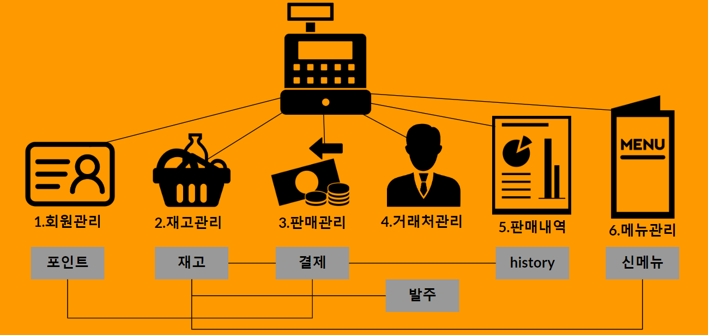
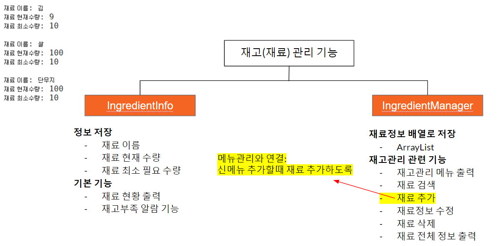

# 1. 소개

JAVA를 활용하여 구현한 포스프로젝트입니다.

---

팀 프로젝트 (구성원: 5명)

개발기간: 1개월

배포여부: No

---

- 흐름

## 2. 내가 구현한 주요 기능

재고관리

## 3. 적용기술

JAVA의 OOP, API, 자료구조 개념을 활용하여 구현

## 4. 프로젝트 설명PPT

[https://docs.google.com/presentation/d/1WXDR6JRhT1aKeZtJIDlef5yIFrZhZFUgEjiRbRkqiHE/edit#slide=id.g5876514ba0_0_196](https://docs.google.com/presentation/d/1WXDR6JRhT1aKeZtJIDlef5yIFrZhZFUgEjiRbRkqiHE/edit#slide=id.g5876514ba0_0_196)
